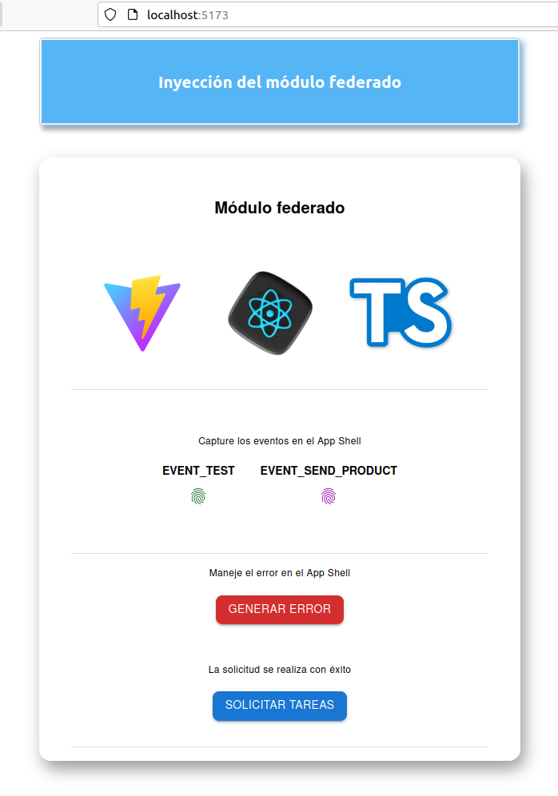
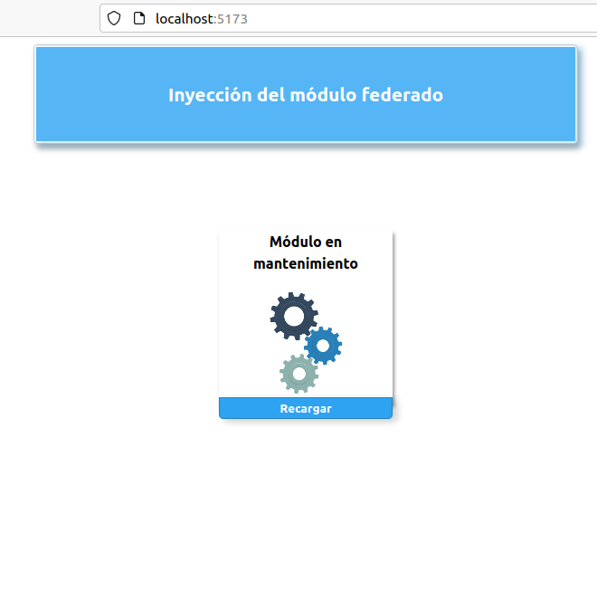
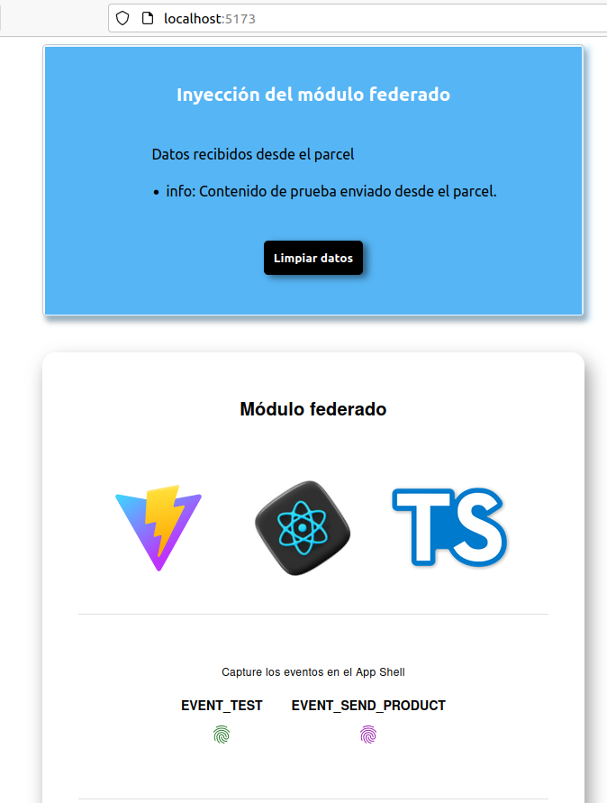
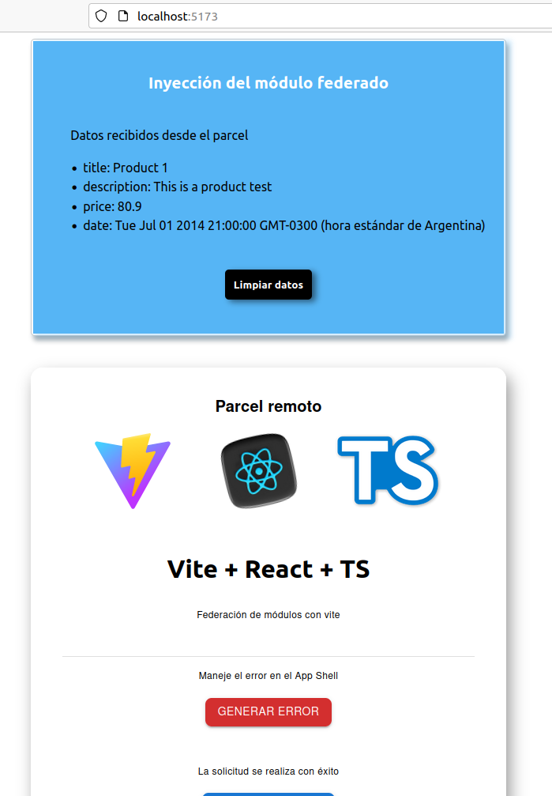

<h1 align="center" >
    Micro Frontend - Implementación de concepto
</h1>

    

 

  <a href="https://github.com/pmNiko/mfe-shell/wiki">Lea más acerca de su implementación</a>

 

---

| Tecnología                       | Documentación                                                                  | Descripción                                                  |
| -------------------------------- | ------------------------------------------------------------------------------ | ------------------------------------------------------------ |
| React                            | https://react.dev                                                              | Interfaces de usuario                                        |
| Typescript                       | https://www.typescriptlang.org                                                 | Extiende JS - Tipado                                         |
| react-error-boundary             | https://github.com/bvaughn/react-error-boundary                                | Manejos de errores del ciclo de vida de componentes de React |
| Vite                             | https://vitejs.dev                                                             | Empaquetador de modulos                                      |
| @originjs/vite-plugin-federation | https://github.com/originjs/vite-plugin-federation#externalstringpromisestring | Plugin de Vite                                               |
| MUI Material UI                  | https://mui.com/                                                               | Biblioteca de Componentes                                    |

---

 

 App Shell

    

---

 

 Manejo del error de rendereo

    

---

 

 Captura del evento de prueba

    

---

 

 Captura del evento de de producto

    

---

    

        ¿Como funciona?
    

    

        El App Shell maneja la estructura general del proyecto web, digase el layout, nav, header, footer, menu.
          Con esta estrategia se lograria consumir componentes que tengan una sola responsabilidad, siendo capaces de acoplar 
            su lógica al proyecto general de manera simple. 
          De esta manera podriamos sumar funcionalidades al proyecto como si de un conjunto se tratara.
          Es importante comprender que al igual que multiples estrategias tiene sus pro y contras.
    

- [mfe-parcel](https://github.com/pmNiko/mfe-parcel)

 

 

---
